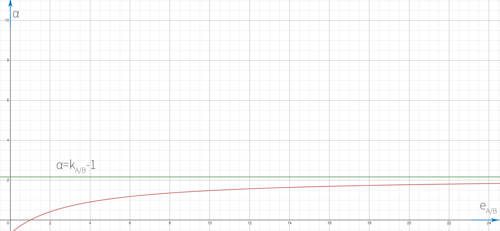
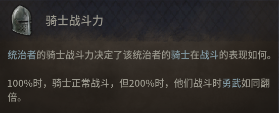
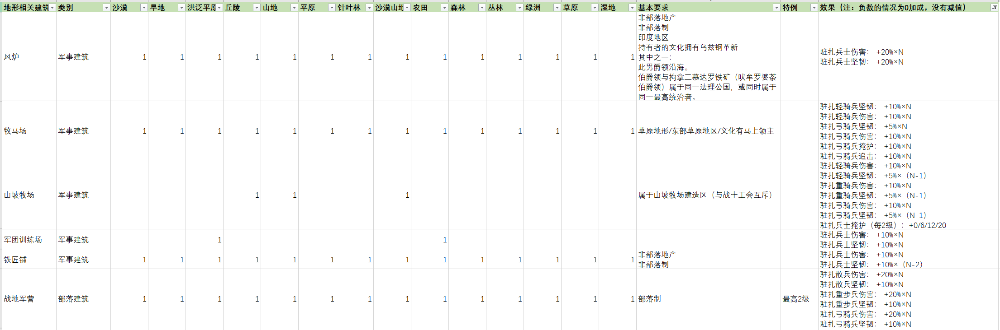
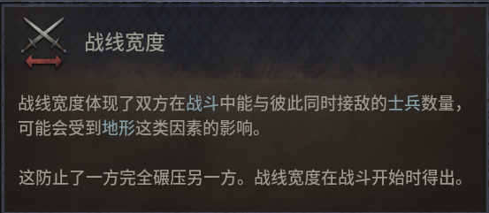

# CK3战斗机制解析、战斗力计算和兵士推荐

## 前言

十字军之王3（CK3）的战斗机制以及究竟什么样的兵士才厉害

#### 致谢：

[Wethospu（P社论坛）](https://forum.paradoxplaza.com/forum/members/wethospu.1434170/)：战斗机制的大部分实测结果和数据来源都来自于这位大佬。

[贵妃娘娘（哔哩哔哩）](https://space.bilibili.com/1381288/article)：这位UP写的新手教学比较易懂，新手看不懂本篇文章的话，可以先去看他的攻略。骑士优先部署权（即骑士伤害不受战场宽度影响）就是从这里知到的，我还没有去实测，如果有实测结果的话，务必联系在下。

[CK3的维基百科](https://ck3.parawikis.com/wiki/%E9%A6%96%E9%A1%B5)：CK3中文维基百科有比较全面的参考资料，虽然部分内容跟不上最新版本，导致描述跟游戏内不一致。大家可以同时参考CK3的英文维基百科来对照。

## 战斗顺序

**每场战斗分为四个阶段：调动阶段、战斗阶段前期、战斗阶段后期和追击阶段**。

-  **调动阶段**：机动阶段发生在战斗开始时，持续三天，在此期间**双方均不造成伤亡**。调动阶段结束后会决定此次战斗的战场宽度，将领则会投掷出最初的[优势骰](#优势)（基础为0到10的随机数）。
-  **战斗阶段前期**：战斗阶段前期持续12天。这个阶段不能主动撤退，如果一支军队在战斗阶段前期被击败，这支军队将被全歼。两个战斗阶段中的大多数伤亡都被视为溃逃（基础战死比例为30%），并将在追击阶段返回军队。
-  **战斗阶段后期**：战斗的第15天开始进入战斗阶段后期，**持续到一支军队军力归零或决定撤退为止**。在战斗后期阶段结束之前的任何时刻，你都可以通过右键单击目的地**来命令你的部队撤退**。这样做会立即开始追击阶段，你的对手将成为追击者，在必输的战斗中主动撤退可减少伤亡。战斗阶段前期和后期，除了是否能主动撤退以及战败的严厉惩罚以外，没有其他区别。
  - **战斗阶段的伤害计算**，每轮执行以下操作【一天为一轮】：
    1. 计算每个部队的伤害，部队伤害=最终伤害×兵士克制修正×优势差修正×战场宽度修正×当前军力×0.03。【注：骑士不受战场宽度限制（未测试）】
    2. 将全部的部队伤害累加，计算出总伤害。
    3. 根据敌方部队的军力占比分配总伤害【比如若敌方部队当前剩下99军力的征召兵和1军力的骑士，骑士只会受到1%总伤害】。
    4. 每个部队所受伤害除以对应部队的坚韧，来计算每个部队的军力损失。
    5. 计算战死和溃逃（基础战死率为 30%）。
    6. 对于击杀结算，根据部队造成的伤害分割总击杀数（如果部队造成总伤害的 50%，则它将获得 50% 的击杀数）。

-  **追击阶段**：追击阶段持续3天，获胜的军队试图追杀另一方的「溃逃士兵」，让其成为「战死士兵」。
  - 获胜的军队将对溃逃的军队持续造成伤害，并且不会受到任何伤害，在此阶段的伤亡被视为战死。
  - **追击阶段时，军队的伤害属性不再生效，取而代之的是追击属性**。战败的军队在撤退过程中会共计承受5%剩余总军力的被动损失（战斗日志里记为“撤退时掉队”）。撤退中掉队的部队会计算为追击中的击杀，且按照一定规则分配给追击部队，导致追击为0的部队看起来在追击阶段也有一定击杀。
  - 当阶段结束时，被击败的军队将随同所有幸存的「溃逃士兵」转移到相邻的男爵领中，军队将会溃逃过几个男爵领后，才能再次接受命令，溃逃时部队移动速度将比受控军队快一些。

## 军队

军队一般由四种主要部队构成：征召兵、骑士、兵士、将领。

### 部队的属性构成

-  **军力**（Strength)：表示部队中有多少士兵。重骑兵每个规模有50名士兵、象骑兵每个规模有25名士兵、攻城武器每个规模有10名士兵（攻城武器不参与战斗)、其他兵士每个规模有100名士兵。征召兵的军力是他们的总人数，每个骑士的军力为1。
  - 军队的总伤害等于每个部队的军力×部队伤害，然后求和。当部队撤退或死亡时，就不再参与战斗，因此该部队自然会造成更少的伤害。
  - 即使是骑士，在受到伤害后造成的伤害也会减少。例如，军力为 0.97 的骑士造成的伤害会变成原本的 97%。
  - 军力会影响敌人将伤害传递给该单位的比例。如果你有 1 名骑士和 99 名征召兵，那么骑士将承受 1% 的伤害，征召兵将承受 99% 的伤害。
-  **伤害**（Damage)：每点在战斗阶段每轮造成0.03伤害，每天结算一次。例如，征召兵有 10 伤害，因此 100 名征召兵会造成 100 × 10 × 0.03 = 30 伤害，杀死 3 名敌方征召兵。
-  **坚韧**（Toughness)：减少伤害导致的损失（包括溃逃和战死)，每点允许在失去所有军力前承受1伤害。当一个单位受到伤害时，坚韧会影响军力损失的程度。如果征召兵受到 100 点伤害，则意味着损失 10 点军力。散兵只会损失 100 / 16 = 6.25 军力【注：实际计算中并不会四舍五入，只是游戏中会取整显示罢了】。
-  **追击**（Pursuit)：每点在追击阶段每轮造成0.17伤害。比如100人的弓骑兵有40追击，那么追击阶段【共计3天】总共造成2000伤害，不考虑掩护的话可以足够消灭200个征召兵。
-  **掩护**（Screen)：每点在追击阶段每轮额外吸收0.33伤害；每轮追击阶段受到的总伤害，先减去由总掩护吸收的部分，然后再将伤害根据军力占比分配给部队。掩护只计算总值，作用于整个军队。
- 兵士军团的**最大数量**：决定最多建立几个兵士军团。头衔等级（伯爵+2、公爵+3、王国+4、帝国+5）、革新（校阅场+1、家兵+1、兵士+1、常备军+1）、宗族传承（5级军事传承+1）
- 兵士军团的**规模上限**：兵士军团可以增加规模，增加规模的费用与招募他们的费用相同。规模上限决定每个兵士军团可以维持的最大规模。

### 部队的属性叠加机制

**最终伤害** = （基础伤害+地形外的固定数值加成）×（1+百分比加成）×（1+勋号骑士军队修正）+ 地形加成

**最终坚韧** = （基础坚韧+地形外的固定数值加成）×（1+百分比加成）×（1+勋号骑士军队修正）+ 地形加成

**最终追击** = （基础追击+地形外的固定数值加成）×（1+百分比加成）×（1+勋号骑士军队修正）+ 地形加成

**最终掩护** = （基础掩护+地形外的固定数值加成）×（1+百分比加成）×（1+勋号骑士军队修正）+ 地形加成

### 战斗力公式

这里直接给结论，想要看完整推导过程可以去附录看[战斗力公式推导](#战斗力公式推导)。

**精锐度**：兵种的伤害和坚韧乘积的算术平方根为精锐度，表示部队装备的精良程度，用 **e** 表示。精锐度表达式如下：

- $e=\sqrt{DT}$
- 数量越少，精锐度越高的部队，受到战场宽度的限制越少（单独作战时也会让敌军受到更多战场宽度的限制）。

**攻击系数**：兵种的伤害除以坚韧的商的算术平方根为攻击系数，表示部队侧重攻击的程度，用 **k** 表示。攻击系数的表达式如下：

- $k=\sqrt{D/T}$
- 相同战斗力的部队，如果攻击系数越高，则表示伤害越高，就更容易在战斗阶段前期击溃敌人，从而实现秒杀。

**标准战斗力**：单一兵种的部队战斗力，等于兵种的伤害和坚韧乘积的算术平方根乘以部队的军力。用c表示标准战斗力，D表示兵种伤害，T表示兵种坚韧，S表示部队人，则有如下表达式：

- $c=\sqrt{DT}\times S=e\times S$
- 无其他加成的情况下：100人征召兵（10伤害、10坚韧）的标准战斗力为100×10=1000；100人披甲步兵（32伤害、22坚韧）的标准战斗力为26.53×100=2653，跟265.3人的征召兵部队战斗力相同。

**有效战斗力**：**部队的有效战斗力与标准战斗力的平方成正比**（有效战斗力也可以直接当成标准战斗力的平方，具体数值为多少无关紧要，也跟有效战斗力的定义有关，关键是大小关系），所以标准战斗力之间的倍数关系在战斗中还得平方一下。用标准战斗力的好处是数值小，而且跟部队人数为线性关系，易于简单计算和理解，而且不影响判断输赢。

#### 标准战斗力如何预测战斗阶段的结果

标准战斗力大的一方会获得战斗胜利。假设红方A和蓝方B交战，将两方的标准战斗力平方以后相减，再开平方根即可得到剩余的标准战斗力。公式如下：

- $c_{|A-B|}=\sqrt{|c_A^2-c_B^2|}$
- 比如红方1000人征召兵（标准战斗力为10000）和蓝方500人征召兵交战（标准战斗力为5000），不考虑其他影响，结果如下：
  - $\sqrt{10000^2-5000^2}=\sqrt{75000000}=8660$
  - 红方剩余8660的标准战斗力。因为征召兵的精锐度为10，所以红方部队还有866军力（就是说战斗阶段结束时战场上还存在866征召兵，剩下的溃逃或者战死），蓝方则损失全部军力。
  - **注意**：损失全部军力不代表就全死了，战斗阶段大多数伤亡都被视为溃逃（基础战死比例为30%），并将在追击阶段返回军队。

#### 不同兵种的部队合并后，标准战斗力如何叠加

**以部队A和部队B的合并为例**，部队A只由兵种A组成，部队B只由兵种B组成。

$c_{A+B}=\sqrt{c_A^2+c_B^2+2(\alpha +1)c_Ac_B}=\sqrt{(c_A+c_B)^2+2\alpha c_Ac_B}$

α为混合系数，跟兵种A和兵种B的精锐度 e 比值，和攻击系数 k 的比值有关，公式如下：
- $\alpha=\frac{1}{1+\frac{e_{a/b}}{k_{a/b}}}\cdot e_{a/b}+\frac{1}{1+\frac{k_{a/b}}{e_{a/b}}}\cdot\frac{1}{e_{a/b}}-1$

- $\lim_{e_{A/B}\rightarrow+\infty}\alpha = k_{A/B}-1$
  - 两个兵种之间的攻击系数比值越大，混合系数的极限越高
- 当kA/B＞1时，eA/B＞1则α＞0，此时两种兵种混合以后比单一兵种更好；eA/B＜1则α＜0，此时两种兵种混合以后反而不如单一兵种。
- 当kA/B＜1时则相反（因为是对称的，我们定义A的攻击系数 ≥ B的攻击系数高就不用考虑这种情况了）。在兵种混合时，精锐度越高的单位有越高的攻击系数，增加的战斗力越多。
- kA/B＞1时，α是关于eA/B的单调递增函数。

- 精锐度相同或者攻击系数相同的部队之间的混合系数 α 为0。所以相同部队的标准战斗力叠加公式如下：
  - $c_{A+B}=\sqrt{c_A^2+c_B^2+2c_Ac_B}=\sqrt{(c_A+c_B)^2}=c_A+c_B$

**关于混合系数，有以下结论**：

- 在兵种混合时，数量少的高精锐度单位应该更多侧重伤害。高攻低血的高质量单位在混合时会让整个军队的有效战斗力提高，低攻高血的高质量单位则相反。
- 在兵种混合时，数量多的低精锐度单位应该更多侧重坚韧，以便更好得充当肉盾。

- **举例**，10个10勇武骑士，精锐度为316.2，攻击系数为3.162，标准战斗力为3162，单独作战的时候相当于316.2个征召兵。搭配2000征召兵，精锐度为10，攻击系数为1，标准战斗力为20000。
  - 精锐度比值eA/B=31.62，攻击系数比值kA/B=3.162，计算出混合系数为1.9。
  - 所以合并以后的标准战斗力为27871，相当于2787.1个征召兵，比单纯的2316.2个征召兵要强很多。
  - **当混合部队之间的标准战斗力相同的时候，部队之间混合系数对战斗力的影响最大，想要靠混合部队来增加军队战斗力的话，尽量让部队之间战斗力相近**。
    - 当混合部队之间的标准战斗力相同的时候，混合兵种的标准战斗力等于单一兵种时的$\sqrt{1+\alpha/2}$
    - 比如10个10勇武骑士，精锐度为316.2，攻击系数为3.162，标准战斗力为3162。跟标准战斗力为3162的征召兵混合。合并以后的标准战斗力为8831，等于20个10勇武骑士 或者 632.4个征召兵的战斗力的 1.4倍。
    - 极限条件下（即一个兵种精锐度接近无穷大，军力接近无穷小；相当于另一个低精锐度兵种全部死亡之前，这个兵种都能维持100%军力，即造成满额伤害），混合兵种的标准战斗力接近单一兵种时的$\sqrt{\frac{1}{2}(1+k_{A/B})}$

**三个兵种混合的情况**

- $c_{A+B+C}=\sqrt{c_A^2+c_B^2+c_C^2+2(\alpha_{AB} +1)c_Ac_B+2(\alpha_{AC} +1)c_Ac_C+2(\alpha_{BC} +1)c_Bc_C}$

**任意兵种混合的情况**

- $c_U=\sqrt{(\sum_{i=1}^nc_i)^2+\sum_{i=1}^n(\sum_{j=i+1}^n2\alpha_{ij}c_ic_j)}$
  - $U=u_1+u_2+u_3+\cdots+u_n$

### 征召兵

征召兵主要由装备简陋的战士（农民民兵、市井无赖、当地佣兵、穷困贵族和小地主等）构成，并被认为是一种独有的部队类型。来源是每个男爵领地产，玩家通过直辖领地获得，或者从封臣间接获取 ；**因为征召兵的伤害和坚韧属性基本上吃不到什么加成，中后期属性完全不够看，征召兵在战斗中往往充当炮灰的作用**，征召兵在未集结的时候没有维护费，但是补员速度很慢。

因为派系阈值会无视军队质量，只根据军队上限来计算，所以征召兵还有压制派系的作用。

| 兵种   | 招募费用 | 未集结的维护费 | 集结后的维护费      | 伤害 | 坚韧 | 追击 | 掩护 |
| ------ | -------- | -------------- | ------------------- | ---- | ---- | ---- | ---- |
| 征召兵 | 0        | 0              | 0.33（每月每100人） | 10   | 10   | 0    | 0    |

### 骑士

骑士可以理解为全副武装的武将（高加成的骑士可以做到百人敌、千人敌），不同文化对骑士有不同的称呼。骑士在战场中所向披靡，由于伤害分配机制，骑士在大规模战斗中受到的伤害非常少，而且骑士会提供非常高的伤害，因此全程都可以提供非常稳定的输出。

**注意**：骑士在坚韧降低到0的时候会视为溃逃，不会战死；骑士只会在骑士之间的战场事件（决斗事件）中受伤和死亡，在战败后有概率受伤、被俘和死亡。

- 如果一支军队输掉了一场战斗，每位骑士有10%概率被俘虏和囚禁，5%概率被杀死。如果军队在战斗阶段前期被击败，对应的概率将提升至55.3%和27.6%。

| 兵种 | 招募费用 | 未集结的维护费 | 集结后的维护费 | 伤害                          | 坚韧                         | 追击 | 掩护 |
| ---- | -------- | -------------- | -------------- | ----------------------------- | ---------------------------- | ---- | ---- |
| 骑士 | 0        | 0              | 0              | 100×勇武×（1+骑士战斗力加成） | 10×勇武×（1+骑士战斗力加成） | 0    | 0    |

**骑士的标准战斗力的极限究竟是多少**？

- 不考虑卡双建筑BUG的话，可以当成平均100勇武，+900%骑士战斗力，骑士数量为50。
- 此时单个骑士标准战斗力为31622，等于3162个征召兵。50个骑士的部队等于15810个征召兵的部队（没考虑战场宽度和部队混合）。
  - 像那些20个骑士就爆杀十多万蒙古大军的，基本上是开了MOD，原版是很难做到的。

**骑士战斗力**

**骑士战斗力的主要来源**：军事线的骑士统帅**+75%**，唯有强者文化传统**+100%**，证明的权力文化传统**+25%**，军事总管训练将领**+军事总管的军事属性%**，剑术大师勋号骑士**+80%**。剩下的部分来自宝物和直辖的建筑。

**勇武的主要来源**：太多了暂时不想列举，可以参考这个百度贴吧的[极限高达养成思路](https://tieba.baidu.com/p/8508239540)。

### 兵士

兵士（Men-at-Arm），简称MAA，可以理解为定期操练、装备良好的职业士兵。每种类型的兵士都克制至少一种其他类型的兵士，若军团被克制，其伤害下降，伤害同军团**规模**之差成比例【注：详细请看[兵种克制](#兵种克制)】。兵士军团每月以其最大规模的10%进行补员。封建制和氏族制统治者以金钱招募和给养兵士，部落统治者则花费两倍数值的威望。 所有兵士（除了战象）集结后的维护费是平时的3倍（象骑兵例外，为3.5倍)。

由于兵士可以通过驻扎获得建筑的高额百分比属性加成，所以兵士在游戏中后期将作为战斗的绝对主力。

#### 重骑兵

| 军团名     | 招募费用 | 集结后的维护费 | 每级规模的军力 | 伤害 | 坚韧 | 追击 | 掩护 | 克制   | 有利地形  | 不利地形                                   | 要求           | 时代       |
| ---------- | -------- | -------------- | -------------- | ---- | ---- | ---- | ---- | ------ | --------- | ------------------------------------------ | -------------- | ---------- |
| 敕令骑兵   | 240      | 2.52           | 50             | 125  | 40   | 20   | 10   | 弓箭手 | 旱地 平原 | 沙漠山地 丘陵 丛林 山地 湿地 正常冬天 寒冬 | 武功歌传统     | 中世纪晚期 |
| 铁甲圣骑兵 | 260      | 2.73           | 50             | 120  | 35   | 25   | 10   | 弓箭手 | 旱地 平原 | 沙漠山地 丘陵 山地 湿地 正常冬天 寒冬      | 东罗马遗产传统 | 部落时期   |
| 披甲骑兵   | 200      | 2.1            | 50             | 100  | 35   | 20   | 0    | 弓箭手 | 旱地 平原 | 沙漠山地 丘陵 山地 湿地 正常冬天 寒冬      | 拱形马鞍革新   | 中世纪早期 |
| 莫納斯帕   | 250      | 2.625          | 50             | 110  | 30   | 25   | 10   | 弓箭手 | 丘陵 山地 | 沙漠山地 湿地 正常冬天 寒冬                | 高加索之狼     | 部落时期   |

#### 重步兵

| 军团名     | 招募费用 | 集结后的维护费 | 每级规模的军力 | 伤害 | 坚韧 | 追击 | 掩护 | 克制              | 有利地形                     | 不利地形  | 要求                             | 时代       |
| ---------- | -------- | -------------- | -------------- | ---- | ---- | ---- | ---- | ----------------- | ---------------------------- | --------- | -------------------------------- | ---------- |
| 禁军       | 180      | 2.4            | 100            | 60   | 30   | 0    | 20   | 长枪兵            | 无                           | 无        | 【罗马文化】军团士兵革新         | 中世纪晚期 |
| 瓦兰吉老兵 | 150      | 2              | 100            | 45   | 30   | 10   | 0    | 长枪兵 重骑兵     | 农田 平原 丘陵 正常冬天 寒冬 | 无        | 沿海战士传统                     | 部落时期   |
| 家族近卫   | 50       | 1              | 100            | 40   | 32   | 0    | 24   | 长枪兵X2 弓箭手X2 | 无                           | 无        | 完成宗族军事传承 军团规模上限为5 | 部落时期   |
| 伙伴卫队   | 117      | 1.56           | 100            | 40   | 30   | 0    | 30   | 长枪兵            | 无                           | 无        | 伙伴卫队传统                     | 部落时期   |
| 穆巴里尊   | 108      | 1.44           | 100            | 45   | 25   | 0    | 0    | 重步兵 长枪兵     | 无                           | 无        | 穆巴里尊传统                     | 部落时期   |
| 侍卫       | 115      | 1.53           | 100            | 40   | 26   | 0    | 24   | 弓箭手 长枪兵     | 森林 针叶林 正常冬天 寒冬    | 无        | 家族私兵传统                     | 部落时期   |
| 山地兵     | 108      | 1.44           | 100            | 40   | 26   | 0    | 0    | 长枪兵            | 沙漠山地 山地 正常冬天 寒冬  | 无        | 喜马拉雅定居者传统               | 部落时期   |
| 教团骑士   | 90       | 1.2            | 100            | 36   | 26   | 0    | 0    | 长枪兵            | 无                           | 无        | 基督教骑士团                     | 部落时期   |
| 朅伽剑师   | 108      | 1.44           | 100            | 42   | 22   | 0    | 0    | 轻骑兵 长枪兵     | 丛林                         | 无        | 朅伽法会传统                     | 部落时期   |
| 宫殿卫队   | 108      | 1.44           | 100            | 38   | 24   | 0    | 20   | 长枪兵X2          | 丘陵 丛林                    | 无        | 侍卫亲军传统                     | 部落时期   |
| 瑟拉维特   | 108      | 1.44           | 100            | 32   | 26   | 0    | 10   | 轻骑兵            | 沙漠山地 丘陵 山地           | 沙漠 旱地 | 阿姆哈拉山民传统                 | 中世纪盛期 |
| 游侠       | 75       | 1.08           | 100            | 35   | 22   | 12   | 0    | 长枪兵            | 无                           | 无        | 侠义结社传统                     | 部落时期   |
| 披甲步兵   | 90       | 1.2            | 100            | 32   | 22   | 0    | 0    | 长枪兵            | 无                           | 无        | 棉甲革新                         | 部落时期   |
| 着甲侍从   | 99       | 1.32           | 100            | 34   | 20   | 0    | 10   | 长枪兵 弓箭手     | 森林 丘陵 山地               | 湿地      | 山地农田传统                     | 部落时期   |

#### 长枪兵

| 军团名       | 招募费用 | 集结后的维护费 | 每级规模的军力 | 伤害 | 坚韧 | 追击 | 掩护 | 克制                           | 有利地形                | 不利地形           | 要求                                    | 时代       |
| ------------ | -------- | -------------- | -------------- | ---- | ---- | ---- | ---- | ------------------------------ | ----------------------- | ------------------ | --------------------------------------- | ---------- |
| 苏格兰长枪兵 | 112.5    | 1.35           | 100            | 36   | 28   | 0    | 0    | 重骑兵 轻骑兵                  | 沙漠山地 丘陵 山地 平原 | 无                 | 血浓于水传统                            | 中世纪晚期 |
| 长矛兵       | 97.5     | 1.17           | 100            | 40   | 24   | 0    | 0    | 重骑兵  轻骑兵 骆驼骑兵 象骑兵 | 沙漠山地 丘陵 山地      | 无                 | 共和制传承传统                          | 中世纪盛期 |
| 国土佣仆     | 90       | 1.08           | 100            | 30   | 24   | 0    | 0    | 重骑兵X2 轻骑兵X2 长枪兵X0.5   | 沙漠山地 丘陵 山地      | 无                 | 【中日耳曼传承 德意志区域】双手巨剑革新 | 中世纪晚期 |
| 长枪兵       | 75       | 0.9            | 100            | 22   | 24   | 0    | 0    | 重骑兵  轻骑兵 骆驼骑兵 象骑兵 | 沙漠山地 丘陵 山地      | 无                 | 无                                      | 部落时期   |
| 邦迪         | 50.2     | 0.6            | 100            | 14   | 18   | 12   | 0    | 轻骑兵 弓箭手                  | 农田 平原 正常冬天 寒冬 | 丘陵 山地 沙漠山地 | 沿海战士传统                            | 部落时期   |

#### 散兵

| 军团名         | 招募费用 | 集结后的维护费 | 每级规模的军力 | 伤害 | 坚韧 | 追击 | 掩护 | 克制          | 有利地形                | 不利地形 | 要求                                                         | 时代       |
| -------------- | -------- | -------------- | -------------- | ---- | ---- | ---- | ---- | ------------- | ----------------------- | -------- | ------------------------------------------------------------ | ---------- |
| 约姆斯维京海盗 | 63       | 0.63           | 100            | 30   | 30   | 40   | 40   | 重步兵 弓箭手 | 正常冬天 寒冬           | 无       | 诺斯原始宗教骑士团/升格马恩岛及群岛王国决议的事件部队/北境群雄事件 | 部落时期   |
| 山民           | 81       | 0.81           | 100            | 20   | 16   | 20   | 10   | 重步兵 轻骑兵 | 沙漠山地 丘陵 山地      | 沙漠     | 山地放牧传统                                                 | 部落时期   |
| 几内亚山民     | 54       | 0.54           | 100            | 18   | 14   | 0    | 20   | 重步兵        | 旱地 森林 丘陵          | 无       | 高地散兵传统                                                 | 部落时期   |
| 守卫           | 45       | 0.45           | 100            | 10   | 24   | 0    | 40   | 重步兵        | 无                      | 无       | 防守战术传统                                                 | 部落时期   |
| 古腾塔克民兵   | 45       | 0.45           | 100            | 13   | 18   | 0    | 16   | 重骑兵 重步兵 | 无                      | 无       | 圩田传统                                                     | 中世纪晚期 |
| 非洲之角勇士   | 45       | 0.45           | 100            | 12   | 16   | 0    | 20   | 重步兵        | 沙漠山地 丘陵 山地      | 无       | 山地散兵传统                                                 | 部落时期   |
| 轻步兵         | 45       | 0.45           | 100            | 10   | 16   | 10   | 16   | 重步兵        | 森林 丛林 针叶林        | 无       | 无                                                           | 部落时期   |
| 撑杆天兵       | 54       | 0.54           | 100            | 10   | 12   | 15   | 20   | 重步兵        | 沙漠山地 丘陵 山地 湿地 | 无       | 【关切文化】撑杆跳革新                                       | 部落时期   |

#### 轻骑兵

| 军团名       | 招募费用 | 集结后的维护费 | 每级规模的军力 | 伤害 | 坚韧 | 追击 | 掩护 | 克制          | 有利地形            | 不利地形                     | 要求                                                         | 时代       |
| ------------ | -------- | -------------- | -------------- | ---- | ---- | ---- | ---- | ------------- | ------------------- | ---------------------------- | ------------------------------------------------------------ | ---------- |
| 猎骑兵       | 111      | 1.36           | 100            | 40   | 15   | 40   | 15   | 弓箭手        | 沙漠 旱地 平原      | 沙漠山地 丘陵 山地 湿地 寒冬 | 【发现了沙漠战术革新的文化（海外帝国融合文化）】沙漠战术革新 | 中世纪盛期 |
| 骠骑兵       | 110.5    | 1.36           | 100            | 25   | 15   | 60   | 20   | 弓箭手        | 旱地 平原           | 沙漠山地 丘陵 山地 湿地 寒冬 | 骠骑兵突袭传统                                               | 部落时期   |
| 伊比利亚骑手 | 85       | 1.15           | 100            | 22   | 16   | 30   | 50   | 弓箭手        | 旱地 丘陵 平原      | 沙漠山地 山地 湿地 寒冬      | 【伊比利亚地区】伊比利亚骑手革新                             | 部落时期   |
| 轻骑兵       | 85       | 1.05           | 100            | 22   | 15   | 30   | 30   | 弓箭手        | 旱地 平原           | 沙漠山地 丘陵 山地 湿地 寒冬 | 无                                                           | 部落时期   |
| 萨赫勒骑手   | 90       | 1.15           | 100            | 22   | 15   | 30   | 30   | 弓箭手 重步兵 | 沙漠 旱地 平原 绿洲 | 沙漠山地 丘陵 山地 湿地 寒冬 | 【萨赫勒地区】萨赫勒骑手革新                                 | 部落时期   |
| 矮种马骑兵   | 94       | 0.92           | 100            | 22   | 15   | 52   | 30   | 弓箭手        | 丘陵 森林           | 沙漠山地 山地 湿地 寒冬      | 【不列颠群岛地区】矮种马革新                                 | 中世纪盛期 |

#### 骆驼骑兵

| 军团名   | 招募费用 | 集结后的维护费 | 每级规模的军力 | 伤害 | 坚韧 | 追击 | 掩护 | 克制   | 有利地形                | 不利地形                              | 要求                                 | 时代     |
| -------- | -------- | -------------- | -------------- | ---- | ---- | ---- | ---- | ------ | ----------------------- | ------------------------------------- | ------------------------------------ | -------- |
| 骆驼骑兵 | 85       | 0.84           | 100            | 22   | 15   | 20   | 20   | 轻骑兵 | 沙漠 旱地 洪泛平原 绿洲 | 沙漠山地 丘陵 山地 湿地 正常冬天 寒冬 | 【中东、波斯或北非地区】军用骆驼革新 | 部落时期 |

#### 弓箭手

| 军团名               | 招募费用 | 集结后的维护费 | 每级规模的军力 | 伤害 | 坚韧 | 追击 | 掩护 | 克制                        | 有利地形                       | 不利地形       | 要求                   | 时代       |
| -------------------- | -------- | -------------- | -------------- | ---- | ---- | ---- | ---- | --------------------------- | ------------------------------ | -------------- | ---------------------- | ---------- |
| 弩手                 | 88       | 0.9            | 100            | 42   | 18   | 0    | 0    | 重骑兵、 重步兵、弓骑兵x0.5 | 丘陵                           | 沙漠 旱地 平原 | 高级造弓术革新         | 中世纪盛世 |
| 长弓手（中世纪晚期） | 66       | 0.72           | 100            | 44   | 14   | 0    | 0    | 重骑兵 散兵                 | 丘陵                           | 无             | 长弓竞赛传统           | 部落时期   |
| 连弩士               | 82.5     | 0.9            | 100            | 30   | 20   | 0    | 0    | 散兵 弓骑兵×0.5             | 沙漠山地 丘陵 山地             | 无             | 【中华传承】诸葛弩革新 | 部落时期   |
| 波陀底迦步兵         | 76       | 0.66           | 100            | 28   | 16   | 10   | 10   | 象骑兵                      | 丛林 森林 旱地                 | 无             | 【印度地区】竹弓革新   | 部落时期   |
| 长弓手（中世纪盛世） | 66       | 0.72           | 100            | 36   | 12   | 0    | 0    | 重骑兵 散兵                 | 丘陵                           | 无             | 长弓竞赛传统           | 部落时期   |
| 森林守卫             | 60.5     | 0.66           | 100            | 30   | 14   | 10   | 10   | 散兵                        | 森林 针叶林 正常冬天 寒冬      | 无             | 丛林守望者传统         | 部落时期   |
| 荒野猎手             | 55       | 0.66           | 100            | 30   | 12   | 5    | 0    | 散兵                        | 森林 丘陵 丛林                 | 无             | 荒野狩猎传统           | 部落时期   |
| 维格曼               | 61       | 0.66           | 100            | 18   | 20   | 0    | 22   | 散兵                        | 农田 平原 针叶林 正常冬天 寒冬 | 无             | 沿海战士传统           | 部落时期   |
| 长弓手（中世纪早期） | 66       | 0.72           | 100            | 28   | 10   | 0    | 0    | 重骑兵 散兵                 | 丘陵                           | 无             | 长弓竞赛传统           | 部落时期   |
| 弓箭手               | 55       | 0.6            | 100            | 25   | 10   | 0    | 0    | 散兵                        | 森林 丘陵 针叶林               | 无             | 无                     | 部落时期   |
| 长弓手（部落时期）   | 66       | 0.72           | 100            | 20   | 8    | 0    | 0    | 重骑兵 散兵                 | 丘陵                           | 无             | 长弓竞赛传统           | 部落时期   |

#### 象骑兵

| 军团名 | 类别   | 招募费用 | 集结后的维护费 | 每级规模的军力 | 伤害 | 坚韧 | 追击 | 掩护 | 克制            | 有利地形 | 不利地形                         | 要求                         | 时代     |
| ------ | ------ | -------- | -------------- | -------------- | ---- | ---- | ---- | ---- | --------------- | -------- | -------------------------------- | ---------------------------- | -------- |
| 战象   | 象骑兵 | 400      | 2.94           | 25             | 250  | 50   | 0    | 0    | 重步兵X2 散兵X2 | 丛林     | 沙漠山地 山地 湿地 正常冬天 寒冬 | 【印度或东南亚地区】象兵革新 | 部落时期 |

#### 弓骑兵

**弓骑兵兵士列表**：

| 军团名 | 类别   | 招募费用 | 集结后的维护费 | 每级规模的军力 | 伤害 | 坚韧 | 追击 | 掩护 | 克制        | 有利地形       | 不利地形                | 要求         | 时代     |
| ------ | ------ | -------- | -------------- | -------------- | ---- | ---- | ---- | ---- | ----------- | -------------- | ----------------------- | ------------ | -------- |
| 弓骑兵 | 弓骑兵 | 135      | 1.35           | 100            | 45   | 20   | 40   | 30   | 重步兵 散兵 | 旱地 平原 草原 | 沙漠山地 丛林 山地 湿地 | 马上领主传统 | 部落时期 |

**宫廷宝物加成**：【阿尔木】+20%伤害和20%坚韧

**独有勋号骑士加成**：

- 【弓骑兵】：+60%伤害、30%坚韧和40%追击，最大规模+6

**建筑**：

**部落时代（三孔）**

- **最佳地形是部落丘陵**：二级部落（40%驻扎兵士伤害和坚韧），战地军营+牧马场+山地放牧，共计+120%伤害、85%坚韧、20%追击、20%掩护。
- **其次是农田/洪泛平原**：一级城堡（10%驻扎兵士伤害和坚韧），军团训练场+牧马场+铁匠铺，共计+70%伤害、40%坚韧、20%追击、20%掩护。【三孔农田叠这个太浪费经济了，建议还是丘陵叠】
- **然后是丘陵/山地/沙漠山地**：一级城堡（10%驻扎兵士伤害和坚韧），山坡放牧+牧马场+铁匠铺，共计+70%伤害、25%坚韧、20%追击、20%掩护。

**中世纪早期（四孔）**：

因为弓骑兵就三个主要建筑，所以剩下一个建筑可以考虑经济建筑或者印度风炉。

**印度地区4级风炉再+80%驻扎士兵伤害和坚韧**

- 农田/洪泛平原：二级城堡（20%驻扎兵士伤害和坚韧），军团训练场+牧马场+铁匠铺，共计+140%伤害、120%坚韧、40%追击、40%掩护。
- 丘陵/山地/沙漠山地：二级城堡（20%驻扎兵士伤害和坚韧），山坡放牧+牧马场+铁匠铺，共计+140%伤害、95%坚韧、40%追击、40%掩护+6。

**中世纪早期（六孔）**：

因为弓骑兵就三个主要建筑，所以剩下三个建筑可以考虑经济建筑+印度风炉/任意+工场（这个可以说必出了）。

**印度地区6级风炉再+120%驻扎士兵伤害和坚韧**

- 农田/洪泛平原：三级城堡（30%驻扎兵士伤害和坚韧），军团训练场+牧马场+铁匠铺，共计+210%伤害、160%坚韧、60%追击、60%掩护。
- 丘陵/山地/沙漠山地：三级城堡（30%驻扎兵士伤害和坚韧），山坡放牧+牧马场+铁匠铺，共计+210%伤害、115%坚韧、60%追击、60%掩护+12。

**综上所述**：

**中世纪盛世的时候弓骑兵最高面板（农田/洪泛）**【注：计算数值时假设军事顾问军事属性为30，领主军事属性为8】

**345.6伤害** = 45基础伤害 ×（1+210%建筑加成+20%阿尔木+（120%风炉）+【训练将领】军事总管的军事属性%）×（1+60%弓骑兵勋号骑士加成）

**111.8坚韧** = 20基础坚韧 ×（1+160%建筑加成+20%阿尔木+（120%风炉）+【训练将领】军事总管的军事属性%+（统治者的军事属性-8）%）×（1+30%弓骑兵勋号骑士加成）

**89.6追击** = 40基础追击 ×（1+60%建筑加成）×（1+40%弓骑兵勋号骑士加成）

**48掩护** = 30基础掩护 ×（1+60%建筑加成）

此时1个弓骑兵在战斗阶段等于19.7个征召兵，而中世纪盛世已经可以有一万人弓骑兵了，可以吊打AI的十几万大军。

**弓骑兵的额外规模上限为**：+6

### 兵士克制

- 1规模的兵士产生克制因子，数值为45%×**基础克制系数**×克制效率，这个克制因子将会均匀分配给全部被克制的单位，被克制的兵士将会降低等量的伤害（独立乘算）。克制最多只能降低90%的伤害。
- 兵士收到伤害以后，产生的克制因子会降低，修正后的克制因子的数值 = 原克制因子×当前军力/原军力。
- **举例说明**
  - 比如1规模长枪兵（100人）产生45%的克制，如果遇到1规模（50人）的重骑兵，则该重骑兵造成的伤害变为原来的1 - 45% = 55%；
  - 如果遇到2规模的重骑兵，则该重骑兵造成的伤害变为原来的（2-0.45%）/2 = 77.5%；
  - 如果遇到1规模重骑兵、1规模轻骑兵、1规模骆驼骑兵，则这三个规模的部队造成的伤害变为原来的（3-0.45%）/3 = 85%。
- **由此可以得出两个关键的结论**
  - **克制的效果是固定的，并不会随着被克制兵种数量的增加而稀释**。比如，1规模长枪兵克制1规模重骑兵，若1规模重骑兵能造成100伤害，则被克制后的最终伤害为55，减少了45伤害；而1规模长枪兵克制2规模重骑兵，若1规模重骑兵能造成100伤害，则被克制后的最终伤害为200*77.5% = 155，同样减少了45伤害。
  - 在战斗中，克制是动态的，如果克制兵种损失的速率大于被克制兵种的损失速率，则克制的作用会越来越小（反之亦然）。用低坚韧的轻步兵去限制高坚韧的重步兵是一种低效率的行为。
- **如果说克制的效果是固定的，并不会随着被克制兵种数量的增加而稀释，那么堆单一兵士规模的作用是什么呢？**
- **答**：因为AI会建造不同兵士组成的军队，所以会产生针对不同兵士的克制因子。在面对AI时，单一兵士可以保证只受到一种克制，从而使AI其他兵士的克制失去效果。

### 将领

每支军队可以有一位将领——一位指挥这支军队的角色，能使用其  军事能力来提高军队的  优势，将领不能同时作为骑士参与战斗。有许多可以获得的[将领特质](https://ck3.parawikis.com/wiki/特质#将领特质)，这些特质能够对战斗产生直接效果，或者给予战斗外的将领增益。

## 优势

当战斗开始时，双方都会计算出一个贯穿整个战斗并且增加双方所有部队伤害的修正值。优势可以来自特质，地形，建筑或将领的军事能力。每位将领还将每3天进行一次掷骰以增加其优势，并且掷骰会受到各种修正和特质的影响。

每一点**优势差距**使军队的伤害提高 **+2%**，优势较小并不会减少伤害。例如，15 优势 vs 5 优势可提供 +20% 的伤害加成。优势不影响追击阶段。

**初始优势可能受以下因素影响**：

- 基础加成
  - 如果正在防御跨越海峡的敌军，则 **+30**。
  - 如果正在防御跨过主要河流的敌军，则 **+20**。
  - 如果正在防御跨河的敌军，则 **+10**。
  - 如果领主正在率领这支军队，则 **+5**。
  - 如果领地负债，则 **-10**。
  - 如果军队还在集结，则 **-10**。
  - 如果军队补给不足，则 **-10**。
  - 如果军队补给耗尽，则 **-25**。
  - 如果军队登陆作战，则 **-30**。
- 地形和建筑加成
- 指挥官军事值、特质和修正的加成
- 宝物加成（领主和指挥官）

## 战场宽度

**战场宽度的定义**：在战斗的开始（调动阶段结束）决定整场战斗的战场宽度，战场宽度等于双方军力总和除以 2，然后乘战场宽度系数（与地形有关）。数量超过战场宽度的士兵将处于待命阶段，无法造成伤害。骑士不占据战场宽度，也不会被战场宽度限制而减少伤害。

**战场宽度的作用**：如果军队数量超过战场宽度，则战斗阶段中军队造成的总伤害 = 不考虑战场宽度的总伤害×战场宽度/军队数量。比如 1000 征召兵在 900 战场宽度的时候，全都能造成伤害，但是总伤害 ×90%（因此跟只有 900 征召兵在战斗一样）。同样，1000 征召兵在 500 战场宽度上只会造成 50% 的伤害。这使得骑士在战斗中非常高效，因为他们带来了大量的伤害和韧性，而没有真正增加军队规模。

**战场宽度的几个结论**：

假设两方的军力分别为X和Y，且战场宽度系数为α，则战场宽度S =（X+Y）/2×α。

- 由于战场宽度对于伤害的限制，1个100伤害的士兵会比10个造成10伤害的士兵更优。
- 高质量军队以少胜多的时候，要保证自己的数量填满战场宽度，则X≤S，得出 X ≤ αY/（2-α）。
  - 当战场宽度系数为50%的时候（沙漠山地/山地），只要 己方军队 ≤ 敌方军队的1/3，即可填满战场宽度。此时敌人只能造成总军力的1/3伤害，而己方则造成100%伤害。

## 地形对战斗的影响

| 地形                                                         | 行军速度 |  战场宽度系数 |  防御方优势 | 其他效果                              |
| :----------------------------------------------------------- | :------- | :----------------------------------------------------------- | :----------------------------------------------------------- | :------------------------------------ |
|  沙漠山地 | 50%      | 50%                                                          | **+12**                                                      | **−30%** 防御方撤退的损失             |
|  山地 | 50%      | 50%                                                          | **+12**                                                      | —                                     |
|  湿地 | 70%      | 60%                                                          | **+5**                                                       | **+25%** 撤退的损失 **+20%** 战死士兵 |
|  丛林 | 50%      | 70%                                                          | **+6**                                                       | —                                     |
|  洪泛平原 | 100%     | 75%                                                          | —                                                            | —                                     |
|  丘陵 | 80%      | 80%                                                          | **+5**                                                       | —                                     |
|  针叶林 | 80%      | 80%                                                          | **+4**                                                       | —                                     |
|  森林 | 80%      | 90%                                                          | **+3**                                                       | —                                     |
|  沙漠 | 70%      | 100%                                                         | —                                                            | —                                     |
|  旱地 | 100%     | 100%                                                         | —                                                            | —                                     |
|  农田 | 100%     | 100%                                                         | —                                                            | —                                     |
|  绿洲 | 100%     | 100%                                                         | —                                                            | —                                     |
|  平原 | 100%     | 100%                                                         | —                                                            | —                                     |
|  草原 | 100%     | 100%                                                         | —                                                            | —                                     |

# 附录

## 战斗力公式推导

在定义战斗力的时候，首先要确定，在不考虑其他限制和加成的情况下，两军相战，战斗力高的必然获胜；这样战斗力才有比大小的意义。

### 单一兵种

#### 战斗力大小如何预测战斗的输赢

**假设红方（均由兵种A构成）与蓝方（均由兵种B构成）交战，那么根据游戏里的机制，不考虑其他差异的话，如何预测输赢**？

- 假设兵种A的伤害为DA，坚韧为TA，在交战第t轮时的军力为SA（t），初始军力SA（0）= SA0。
- 同理，兵种B的伤害为DB，坚韧为TB，在交战第t轮的军力为SB（t），初始军力SB（0）= SB0。
- 则兵种A的损失函数以及兵种B的损失函数如下：

（1）式除以（2）式，得

根据上述微分方程（3），可以得出以下状态方程（4）

如果定义装备性能（E）为兵种的伤害与坚韧的乘积，即 E = D×T，则上述方程变为（5）

这个方程跟**兰彻斯特作战模型里的平方律**相似，这个方程有简单的结论

- 交战一方的有效战斗力，正比于其初始军力的平方（S02）与每一战斗单位的**装备性能E**（伤害D×坚韧T）的乘积，称其为**平方律**。
- 按照这一定律，如果蓝方的装备性能为红方的4倍，则红方在数量上集中2倍于蓝方的军力就可抵消蓝方装备性能的优势。
- 下述例子说明**平方律**符合集中优势兵力的作战原则：“如果蓝方1000人与红 方1000人交战，双方单个战斗单位的装备性能相同，红方被蓝方分割成各500人的两半。假定蓝方以1000人先攻击红方的500人，则蓝方将以损失134人的代价全歼红方的一半，接着蓝方以剩下的866人再全歼红方的另一半，蓝方在这两次战斗中总共损失293人。”

#### 军队的有效战斗力推导

从另一个角度看，军队的有效战斗力（Combat effectiveness）还可以有如下定义：**军队的有效战斗力，等于军队被全部歼灭之前能够造成的总伤害**。

假设所受伤害为i（Injury），由定义可知，0 ≤ i ≤ S0*T，有如下（6）

求解得出（7）

有效战斗力为（8）

由（8）可知，单一兵种的军队的有效战斗力C，等于其**初始军力的平方**（S02）与每一战斗单位的**装备性能E**（伤害D×坚韧T）的乘积的一半。这是一个三角形的面积公式，将其在平面直角坐标系上表示，可以得到以下图像。

### 两个兵种混合的有效战斗力推导

先考虑两种不同兵种A、和兵种B混合以后的有效战斗力。

（9）式和（10）式，可以得出以下微分方程（11）

求解得（12）

由定义可知，有效战斗力为（13）

将（11）和（12）代入（13）得（14）

化简得到

#### 通过混合兵种来增加军队的战斗力

因为（15）式里有算术平方根，不利于后续计算，定义单一部队的精锐度为e，数值为伤害D和坚韧T的乘积的算数平方根。即：

$e=\sqrt{E}=\sqrt{DT}$

将（15）变为（16）式

单一部队的标准战斗力为c，等于部队的精锐度 e × 部队的军力 S，表达式如下：

$c=eS$

将（16）化简为（17）

#### 混合系数

设混合系数为α

我们就得到了混合兵种有效战斗力的简化表达式（18）。

结论如下：

- 因为 α+1 ＞ 0，所以在一个军队里增加部队，一定会增加军队的有效战斗力。

- 当α＞0时，保证cA+cB的总和不变的情况下，将兵种A的部分替换为兵种B，就有CA+B＞CA+A 。

  - 比如标准战斗力100的弓箭手部队A，和标准战斗力100的重骑兵部队B；在单独成军的时候，两只部队A刚好跟两只部队B同归于尽，即CA+A = CB+B

  - 而如果混合系数α＞0；则CA+B > CA+A = CB+B。合适的部队混合可以增加军队的有效战斗力。

##### 攻击系数

$\alpha=\frac{1}{1+\frac{x}{k}}\cdot x+\frac{1}{1+\frac{k}{x}}\cdot\frac{1}{x}-1$

定义兵种的攻击系数为k，k的数值如下。

$k=\sqrt{\frac{D}{T}}$

$e_{A/B}=\frac{e_A}{e_B}$

$k_{A/B}=\frac{k_A}{k_B}$

可以将混合系数α化简为如下函数

$$\alpha=\frac{1}{1+\frac{e_{a/b}}{k_{a/b}}}\cdot e_{a/b}+\frac{1}{1+\frac{k_{a/b}}{e_{a/b}}}\cdot\frac{1}{e_{a/b}}-1$$

图像如下：

- 当kA/B＞1时，若eA/B＞1，则α＞0。
- 当kA/B＜1时，若eA/B＞1，则α＜0。
- kA/B＞1时，α是关于eA/B的单调递增函数。
- $\lim_{e_{A/B}\rightarrow+\infty}\alpha = k_{A/B}-1$
- 当kA/B=1时，α=0。游戏中，骑士之间勇武不同，但是k相同，所以可以当成同一种部队来看。
- 当eA/B=1时，α=0。也就是说精锐度相同的部队，混合的时候可以当成同一部队。比如，100人（伤害25、坚韧20）的弓箭手，与100人（伤害20、坚韧25）的长枪兵混合，跟只有200人弓箭手或者只有200人长枪兵的战斗力相同。

**结论如下**：

- 在兵种混合时，高精锐度单位（即e更高）应该更多侧重伤害。高攻低血的高质量单位在混合时会让整个军队的有效战斗力提高，低攻高血的高质量单位则相反。
- 在兵种混合时，低精锐度单位（即e更低）应该更多侧重坚韧，以便更好得充当肉盾。

#### 均质化战斗力

游戏里部队的构成非常复杂，有效战斗力的计算会非常困难。由于大部分兵种之间的混合系数非常小，为了快速估计出成分复杂的军队的战斗力，我们忽略掉兵种之间的混合系数的影响，将（18）式的右边部分消去，得到估算的面板战斗力（因为这相当于把军队的构成变成均质化，所以也可以叫均质化战斗力）。两个部队混合的面板战斗力计算公式如下：

$\underline{C_{A+B}}=\frac{1}{2}(c_A+c_B)^2$

- 当整个军队都是由相同兵种（或精锐度e相同、或攻击系数k相同）构成的时候，军队的有效战斗力等于其均质化战斗力（即等于其面板战斗力）。

#### 理想情况下的兵种混合

从（18）式中，可以看出，混合兵种双方的标准战斗力相等时，混合系数α对有效战斗力的影响最大，数学表达式如下：

$\frac{1}{2}(c_A+c_B)=c_A=c_B$

- 极限条件下（即一个兵种精锐度接近无穷大，军力接近无穷小；相当于另一个低精锐度兵种全部死亡之前，这个兵种都能维持100%军力，即造成满额伤害），混合兵种的有效战斗力接近面板战斗力的$\frac{1}{2}+\frac{k_{A/B}}{2}$倍。
- 游戏中当骑士与轻步兵组合时，kA/B最大为4，最理想情况下（即混合的骑士标准战斗力和轻步兵标准战斗力相等，且骑士的标准战斗力远大于轻步兵的标准战斗力），有效战斗力会接近面板战斗力的2.5倍。
- 由于骑士的k是最大的，而且精锐度为e也是最大，所以骑士跟所有部队混合都会发挥更强的战斗力。
- 前期配合征召兵的时候，优先选择精锐度e更高的兵士；精锐度e差不多的情况下，优先选择攻击系数k更大的。如果不考虑骑士的话，长枪兵配合征召兵反而会导致有效战斗力不如面板战斗力（但是有骑士作为输出手就不一样了）。

### 兵士搭配

在实际兵士的搭配中，限制条件是兵士的规模总量有限。比如象兵（250伤害、50坚韧、每规模25人）和瓦兰吉（45伤害、30坚韧、每规模100人）混合时，多1规模象兵就会少1规模的瓦兰吉。尽管象兵和瓦兰吉的混合系数α＞0，但是c的大小也会发生变化。这样的限制条件下，混合以后究竟会增加战斗力还是减少呢？

这里我们将c变成为N和c，N为部队规模，c为每规模部队的标准战斗力。N=NA+NB，且N为常数。

（18）式可以变成（20）。

CA+B为NB的二次函数，当其导数为零时，会取得极值。（20）式求导，让导数等于0。

设$K_{A/B}=\frac{c_A}{c_B}$，得到如下函数（21），当NB/N满足以下方程时，混合以后有效战斗力最大。

- 当α＞KA/B-1时，每规模战斗力更大的A兵种才有混合每规模战斗力更小的兵种B的价值，且α-KA/B-1的值越大，混合以后有效战斗力最大的时候NB/N越高，最后收敛于50%。
- 以瓦兰吉和象兵为例，每规模瓦兰吉战斗力比象兵强，值得在瓦兰吉部队里混入象兵吗？两者混合系数α = 0.344，K瓦兰吉/象兵=1.314，α+1-K瓦兰吉/象兵的值只有0.03，NB/N ≈5%，所以19队瓦兰吉混1队象兵，会比20队瓦兰吉更强。但是实际上强得非常有限，大概也就百分之几，考虑到克制可能反而不如单纯的瓦兰吉。
- 考虑到限制条件为兵士的规模，所以每规模100人的兵士之间里不需要混搭，无脑选择精锐度高的兵种的即可。每规模100人的兵士跟重骑兵、象骑兵混搭，如果搭配合理会有蚊子腿加强（不考虑战场宽度的话，估计还不如10优势来的加成高）。

### 拓展：多种兵种混合的有效战斗力

根据两个兵种混合的有效战斗力公式，可以拓展出任意兵种混合以后的有效战斗力公式如下：

$U=u_1+u_2+u_3+\cdots+u_n$

公式的左边部分为均质化战斗力（即面板战斗力）

- 在大规模混合士兵的时候，可以只考虑相互之间混合系数大且标准战斗力占比多的兵种之间的相互作用即可；
